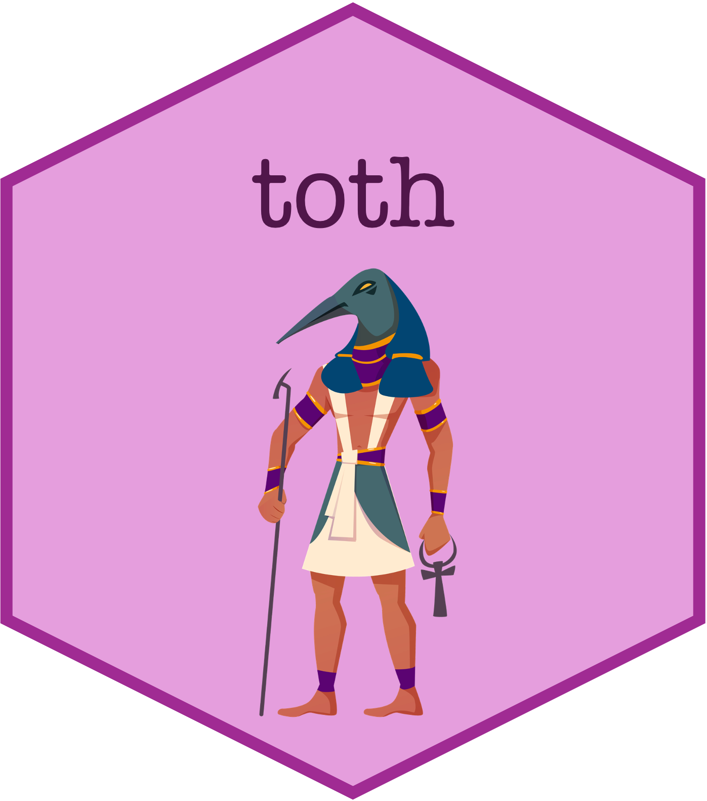

# toth 


<!-- badges: start -->
[](https://github.com/sebrauschert/toth/actions/workflows/R-CMD-check.yaml)
[](https://github.com/sebrauschert/toth/actions/workflows/test-coverage.yaml)
[](https://github.com/sebrauschert/toth/actions/workflows/pkgdown.yaml)
[](https://lifecycle.r-lib.org/articles/stages.html#experimental)
<!-- badges: end -->

## Overview

`toth` is an R package that provides a comprehensive framework for setting up reproducible analytics projects. It integrates best practices for:

- Project organization and structure
- Data version control with DVC
- Containerization with Docker
- Dependency management with renv
- Customizable reporting with Quarto

This package is still in active development and should be used with caution.

# Why Toth?

`toth`, named after the ancient Egyptian deity of wisdom and writing, embodies the essence of preserving and documenting knowledge. Just as Toth was revered for recording the deeds of the living and maintaining cosmic order, this R package ensures analytical integrity through comprehensive version control of code, data and analytical decisions. By seamlessly integrating DVC, Git, and Docker, Toth aims to create a robust framework for reproducible analytics, making it effortless to track data lineage, manage dependencies, and share reproducible environments. Whether you're collaborating on a team project or maintaining consistency in your solo analyses, `toth` serves as your faithful scribe, ensuring that every step of your analytical journey is documented, reproducible, and trustworthy.

## Installation

You can install the development version of toth from GitHub with:

```r
# install.packages("devtools")
devtools::install_github("sebrauschert/toth")
```

## Prerequisites

Before using toth, ensure you have:

1. [DVC](https://dvc.org/doc/install) installed
2. [Docker](https://docs.docker.com/get-docker/) installed
3. [R](https://www.r-project.org/) (>= 4.1.0)
4. [Quarto](https://quarto.org/docs/get-started/) for report generation

## Features

- 📁 Standardized project structure
- 🔄 Data version control setup with DVC
- 🐳 Docker integration for reproducible environments
- 📦 Dependency management with renv
- 📊 Customizable Quarto reporting templates
- 🔧 Best practice workflows for analytics projects

## Usage

### Basic Project Setup

```r
library(toth)

# Create a new analytics project
create_analytics_project("my_project")
```

### DVC Data Tracking

```r
# Track data files with DVC
data |>
  write_csv_dvc("data/processed/mydata.csv", "Updated processed data")

# Track R objects
model |>
  write_rds_dvc("models/model.rds", "Saved trained model")
```

## Documentation

* [Package website](https://sebrauschert.github.io/toth/)
* [Getting Started Guide](https://sebrauschert.github.io/toth/articles/getting-started.html)
* [DVC Guide](https://sebrauschert.github.io/toth/articles/dvc-tracking.html)
* [Docker Setup](https://sebrauschert.github.io/toth/articles/docker-setup.html)
* [Custom Templates](https://sebrauschert.github.io/toth/articles/custom-templates.html)

## Project Structure

When you create a new analytics project with `toth`, it sets up the following structure:

```
my_project/
├── .dvc/               # DVC configuration
├── .git/               # Git version control
├── .gitignore         # Git ignore patterns
├── .Rproj.user/      # RStudio project files
├── data/             
│   ├── raw/          # Raw data (tracked by DVC)
│   └── processed/    # Processed data (tracked by DVC)
├── R/                # R scripts
├── reports/          # Quarto reports
├── docker/           # Dockerfile and related files
├── renv/             # renv library and lockfile
└── README.md         # Project documentation
```

## Contributing

Please see [CONTRIBUTING.md](CONTRIBUTING.md) for guidelines on how to contribute to this package.

## License

MIT 


<sub>Toth icon by [Freepik](https://www.freepik.com)</sub>